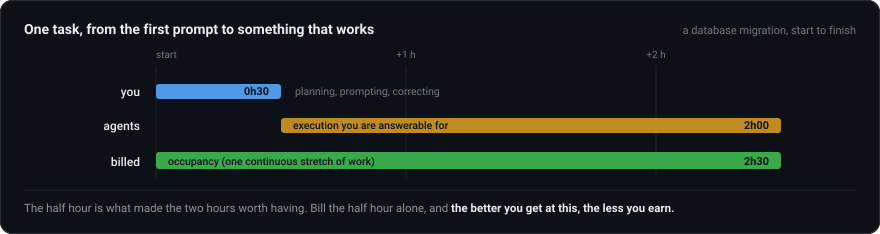
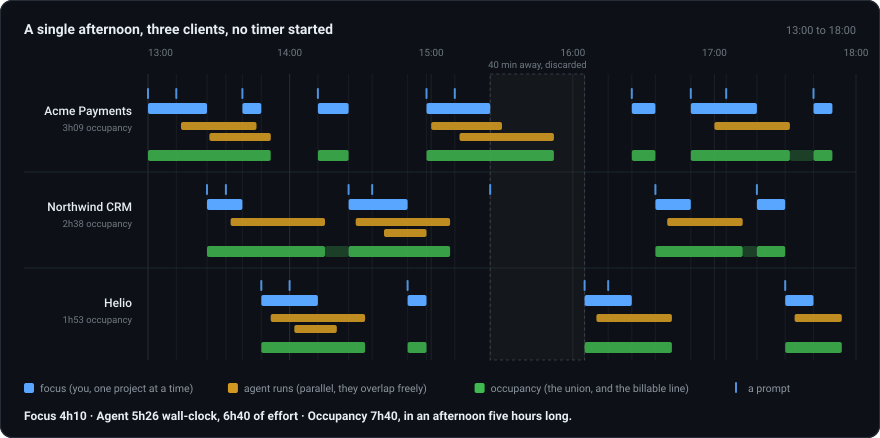
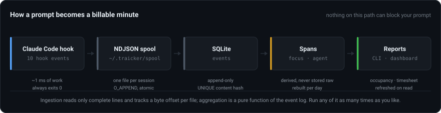

<div align="center">


# trAIcker

**Passive time tracking for people who orchestrate AI agents across several
projects at once.**
No timers, no start/stop, nothing to remember.
Runs as a CLI, a local web dashboard, or a desktop app.

[**gabrielsiedler.github.io/trAIcker**](https://gabrielsiedler.github.io/trAIcker/)


</div>

## Why this way

You are not paid for the half hour you spent typing. You are paid for the two
hours of work that half hour was responsible for, and for those two hours being
right when they land.

<div align="center">
  
</div>

A developer is hired to guarantee quality, reliability and delivery. That did
not change when agents started writing the code. What changed is that the scarce
skill moved from writing it to directing it well. The half hour above is not the
work made smaller, it is the work made denser. Give the same two hours of
execution to someone who can't write that half hour, and the client gets two
hours of confident nonsense, delivered on time.

> ### The better you get at this, the less you earn.
>
> That is what billing your own keystrokes gets you. Every improvement in how
> you brief and correct an agent makes the interval a normal tracker measures
> shorter.

So trAIcker measures three things instead, and keeps them separate on purpose.

<div align="center">
  
</div>

- **Focus** is your orchestration time. Only one project can hold it at a time.
  The interval between one `UserPromptSubmit` and the next one, in any project,
  belongs to whoever got the first. A prompt on project B is what ends focus on
  project A, so there's no toggle to forget. A gap longer than the idle timeout
  is dropped instead of counted (the dashed 40 minutes above are billed to
  nobody).
- **Agent** is autonomous execution. It overlaps freely, because it doesn't
  compete for your attention. You get it as wall-clock (union) and as effort
  (sum).
- **Occupancy** is the two together, with short gaps stitched. How long the
  project was being worked on, by you or by an agent you sent.

**Occupancy is the number you invoice.** It always raises the same three
questions.

*"If you get faster, do I pay less?"* For the same piece of work, yes. What
moves is the rate. An hour that now carries two hours of directed execution is
not the hour you sold two years ago, and pricing it the same is the real
mistake.

*"Isn't billing two projects for the same hour charging twice?"* It would be, if
an hour of occupancy meant you were only on that project. It doesn't, and it
must never be sold that way. Occupancy overlaps: the afternoon above bills 7h40
across three clients, inside five hours of wall clock.

*"Do you have to be watching for it to count?"* No. You picked the approach, you
sent the run, and your name is on what lands. A client who buys presence instead
of delivery is buying something different, and that's a legitimate thing to buy.
Put their `billing.basis` on `focus` and the same log answers their question.

trAIcker doesn't measure code either. Commit counts and diff size became the
easiest signal to fake the moment agents started writing it. **[The full
argument](docs/why.md)** takes the manual timer, code metrics and IDE activity
trackers one at a time.

## Install

```bash
npm install
npm run build
node dist/cli/index.js install-hooks       # writes ~/.claude/settings.json
traicker doctor                            # check capture through the real hook
```

`install-hooks` backs up the current file and merges into it. Hooks you already
have on the same events are left alone. Use `--dry-run` to print the resulting
file first, `--project` to scope it to one repository, and `uninstall-hooks` to
remove only trAIcker's entries.

Restart any running Claude Code session afterwards. Hooks load at session start.

## Use

One binary and one SQLite file, with three front ends over the same data:

| | How you start it | What it's for |
| --- | --- | --- |
| **CLI** | `traicker report`, `traicker week`, … | the fast path, and the only one that scripts |
| **Web dashboard** | `traicker serve`, then `http://localhost:4317` | the timeline, the timesheet panel, editing project settings |
| **Desktop app** | `npm run desktop` (`desktop:dist` to package) | the same dashboard in an Electron window with a tray icon, and the server embedded in it, so there's no `serve` to remember after a reboot |

They can run at the same time. The CLI waits instead of failing when the desktop
app is holding the database.

| Command | What it gives you |
| --- | --- |
| `traicker report` | today, by project (`--week`, `--by-day`, `--from/--to`) |
| `traicker week` | progress against each project's weekly commitment |
| `traicker topics` | what you worked on (`--detail` for one row per prompt) |
| `traicker timeline --day D` | every span of a day, in order |
| `traicker timesheet --project X` | one line per day, for a client's form (`--csv`, `--month`) |
| `traicker add` · `entries` · `rm` | time off the tools: meetings, calls, research |
| `traicker note` · `summarize` · `translate` | fix, rewrite or translate a timesheet line |
| `traicker reproject` | re-attribute history after changing projects in config |
| `traicker serve` | dashboard on `:4317` |
| `traicker status` | data directory, API key, last sync |

Every read refreshes the database first, so the numbers are current without you
running anything by hand. Nothing calls the network during a report.

The dashboard's five tabs are Overview, Timesheet, Projects, Entries and
Settings. It's the only place that writes `config.json` back, and the only place
where a timesheet row gets a copy button. That button is most of the difference
between a tracker you keep using and one you don't.

## Configure

`~/.traicker/config.json`, all keys optional:

```json
{
  "idleTimeoutMinutes": 15,
  "stitchGapMinutes": 10,
  "promptExcerptChars": 80,
  "serverPort": 4317,
  "ignorePaths": ["C:/scratch"],
  "projects": {
    "C:/dev/acme-payments": {
      "name": "Acme Payments",
      "client": "Acme",
      "billable": true,
      "commitment": { "weeklyHours": 10, "kind": "cap" },
      "billing": {
        "basis": "occupancy",
        "weeklyCapHours": 10,
        "roundToMinutes": 15,
        "weekStartsOn": "monday"
      }
    }
  }
}
```

| Key | Default | What it does |
| --- | --- | --- |
| `idleTimeoutMinutes` | `15` | gap between prompts that ends focus instead of counting |
| `idleAttributionCapMinutes` | `120` | most of a single gap that can be reported as idle |
| `stitchGapMinutes` | `10` | gap short enough to bridge inside occupancy |
| `maxTurnMinutes` · `maxSubagentMinutes` | `120` | ceiling for a span whose stop never arrived |
| `promptExcerptChars` | `80` | `0` stores no prompt text at all |
| `ignorePaths` | none | a path and everything under it, except declared projects |
| `projects` | none | name, client, colour, billable, `commitment`, `billing` |

A directory becomes a project the first time an event arrives from it, and **a
project you have not declared is not billable**. The two mistakes cost
differently: an unmarked client is visibly missing from a total, while an
unmarked personal project quietly inflates a figure a client reads. Mark the
paying ones, here or in the dashboard.

`OPENROUTER_API_KEY` goes in `~/.traicker/.env`, and only `summarize` and
`translate` read it. `TRAICKER_DATA_DIR` moves the whole tree somewhere else.

## How it works

<div align="center">
  
</div>

- **The hook does one thing.** It appends a ~200 byte line and exits. It never
  opens the database, never blocks, and always exits 0.
- **A spool, not a direct write.** Concurrent SQLite writers would mean lock
  contention on the path that gates your prompt. Files are sharded by session
  id, and `O_APPEND` covers the parallel-subagent case that's left.
- **Nothing raw is stored.** Only metadata and Claude Code's own session title,
  so no client prompt text reaches the database.
- **Reprocessing is always safe.** Ingestion consumes only complete lines and
  keeps a byte offset per file. Aggregation is a pure function of the event log,
  rebuilt per day inside a transaction.

## Documentation

| | |
| --- | --- |
| [Why this way, and not a timer](docs/why.md) | the argument in full: manual timers, code metrics, IDE trackers, and why occupancy is the billable number |
| [What gets measured](docs/measurement.md) | open spans, manual entries and what they displace, how labels and projects resolve |
| [Billing](docs/billing.md) | caps and targets, timesheets, where a description comes from, translation and refresh |
| [The dashboard](docs/dashboard.md) | the five tabs, and why the timeline changes unit past two days |
| [Architecture](docs/architecture.md) | the pipeline in detail, the hooks used, the desktop shell, and the development setup |
